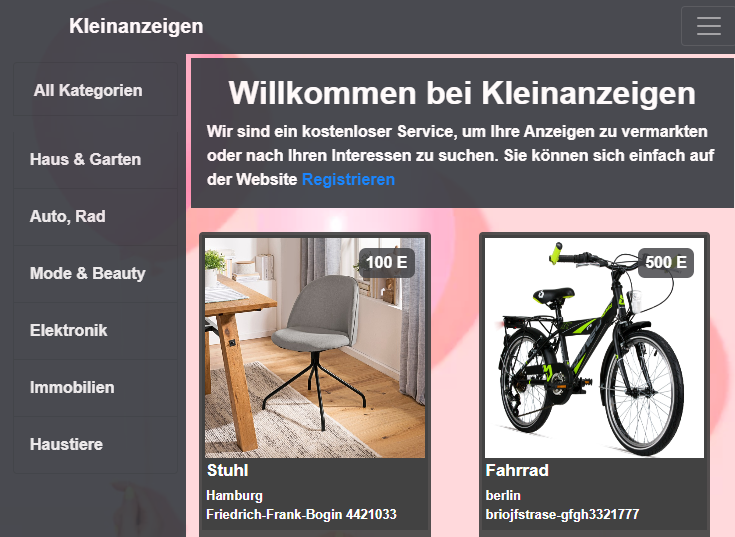

# kleinanzeigen Project

this project is online platform to sell and buy products in differnt categories.
after you register to our website you can login and sell or buy products 
to see the deployed project please visit this link :
[kleinanzeige.herokuapp.com](https://kleinanzeige.herokuapp.com/)

## used Technologies

 - Node js, Express  for Backend
 - MongoDB,Mongoose for the Database
 - EJS Template engine for the forntEnd
 - Bootstrap, css
 - Javascript, Jquery
 

## how to see the products?

 - from the homepage we can take a category and we well see the products, for example : [Auto & Rad](https://kleinanzeige.herokuapp.com/katergorie/Auto,%20Rad)
 - from the Navbar you can search also for prducts `product name or any word form the product description`
 after you click on any product you can see the seller information and you can  contact him using messages or by phone number. 

## how to sell products?
after register and login you can add your products info and upload some photos.
the user will see your contacts info and you will get a message from user according to your product.